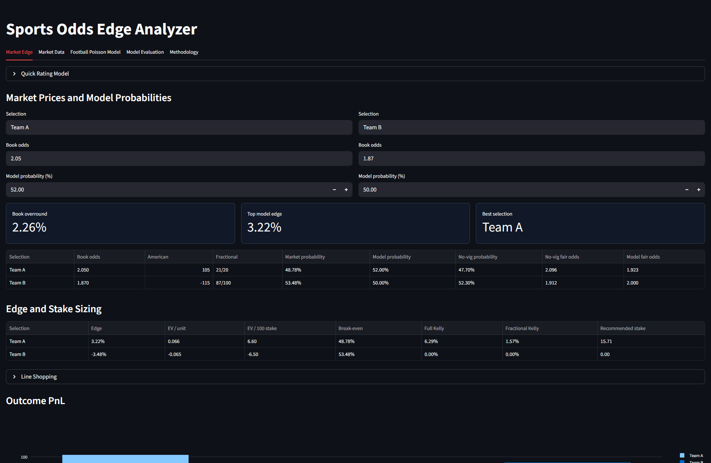
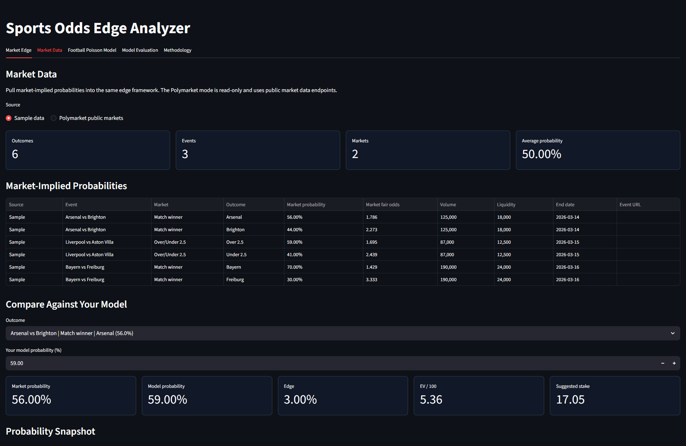
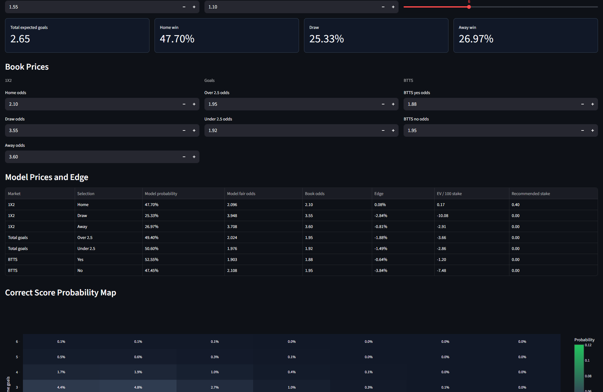
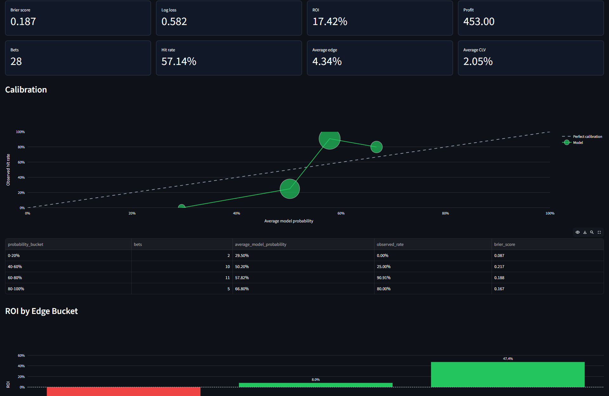
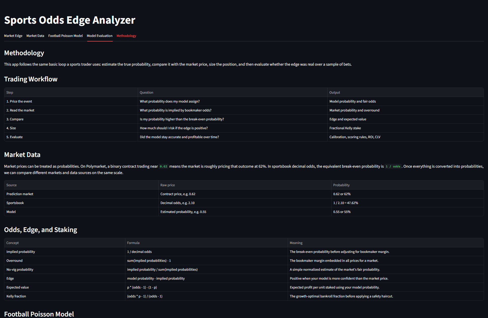

# Sports Odds Edge Analyzer

A Streamlit app for sports trading research. It converts bookmaker prices into
implied probabilities, removes market margin, compares the market against a
simple model, sizes positions with fractional Kelly, and reviews whether model
edge held up over a sample of bets.



## Screenshots

| Market Edge | Market Data | Football Poisson |
| --- | --- | --- |
|  |  |  |

| Model Evaluation | Methodology |
| --- | --- |
|  |  |

## What Each Section Does

### Market Edge

The main pricing worksheet. Enter selections, bookmaker odds, and your model
probabilities. The app converts odds formats, calculates overround, removes vig,
shows model edge, estimates EV, and recommends a fractional Kelly stake.

### Market Data

Loads sample market-implied probabilities or read-only public Polymarket data.
This lets you compare a market probability against your own model probability
without manually entering every price.

### Football Poisson Model

Builds a football score model from expected goals. It prices 1X2, over/under
2.5, BTTS, and correct-score probabilities, then compares model fair odds with
bookmaker prices.

### Model Evaluation

Scores historical prediction logs with Brier score, log loss, ROI, hit rate,
average edge, average closing-line value, calibration, ROI by edge bucket, and
performance curves.

### Methodology

Explains the workflow in plain English: price the event, read the market,
compare probabilities, size the stake, and evaluate the model after results are
known.

## Guides

- [Getting started](docs/guides/getting-started.md)
- [App walkthrough](docs/guides/app-walkthrough.md)
- [Screenshot gallery](docs/guides/screenshot-gallery.md)

## Features

- Decimal, American, and fractional odds conversion.
- Book overround and no-vig probability calculation.
- Market-data tab with sample probabilities and read-only Polymarket public
  market search.
- Manual market entry for two-way, three-way, spread, and tennis winner markets.
- Quick Elo-style model helper for two-way markets.
- Davidson-style draw model helper for football three-way markets.
- Football Poisson model for 1X2, over/under 2.5, BTTS, and correct scores.
- Expected value, edge, break-even probability, fair odds, and Kelly sizing.
- Line shopping comparison across books or exchanges.
- Outcome PnL chart for each selected bet.
- CSV bet-log backtest with ROI, hit rate, drawdown, and closing-line value.
- Model evaluation with Brier score, log loss, calibration, ROI by edge bucket,
  equity curve, and closing-line value distribution.
- Methodology tab explaining the trading workflow, formulas, Poisson model, and
  evaluation metrics in plain English.

## Run Locally

```powershell
python -m pip install -e .
python -m streamlit run app.py
```

## Bet Log Format

Upload a CSV with these columns:

```csv
stake,odds,result,closing_odds
100,2.10,win,1.95
100,1.80,loss,1.75
100,2.40,win,2.20
```

`closing_odds` is optional. `result` accepts `win`, `loss`, `push`, `1`, `0`, or
`0.5`.

## Prediction Log Format

The model evaluation tab accepts a CSV with these columns:

```csv
date,event,market,selection,model_probability,odds,closing_odds,stake,result
2026-01-06,Arsenal vs Brighton,1X2,Arsenal,0.58,1.95,1.82,100,win
2026-01-07,Napoli vs Lazio,Over/Under,Over 2.5,0.54,2.02,1.91,100,loss
```

`model_probability` should be a decimal probability between `0` and `1`.
`closing_odds` is optional.

## Project Structure

```text
sports_trading/
  backtest.py    # bet-log performance analysis
  edge.py        # expected value and Kelly staking
  evaluation.py  # model scoring, calibration, and edge-bucket analysis
  market_data.py # sample and Polymarket probability feeds
  models.py      # quick Elo, Davidson, and football Poisson helpers
  odds.py        # odds conversion and market margin helpers
app.py           # Streamlit dashboard
tests/           # unit tests
```

## Tests

```powershell
python -m unittest discover
```

## Roadmap

- Add optional live odds ingestion with an API key.
- Add sportsbook odds ingestion via The Odds API or a similar provider.
- Add market-specific models for spreads, Asian handicaps, and player props.
- Store backtest sessions and export reports.
- Add closing-line movement charts by market and sport.
